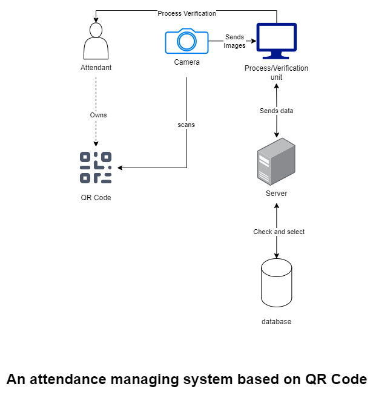

# Matrix codes

In this section, we discuss implementation of **Matrix codes** on an **AMS** system.

QR codes and barcodes falls under the category of [automatic identification and data capture (AIDC) technologies](https://en.wikipedia.org/wiki/Automatic_identification_and_data_capture). These technologies are used to capture and store data (images, videos ect..) and enter that data into a computer with a minimal human interaction.

Both QR codes and barcodes are so important on an **attendance management system** since they don't anything to generate and they are easy to implement on an already existing **ams** (if it's needed too). the issue with them that they are very easy to spoof and using them can potentially lead to some security threat but that's not our subject.

## Barcode

Barcode is a 2-dimensional (**2D**) matrix that is typically used to store a small amount of data on one line of black bars with white background. It's widely used on product identification (such we see in supermarkets). object tracking in general too

### Barcode on an **AMS** system

Old **AMS** used to implement barcodes since they used to store a one-line code sometimes it is just an identification (ID). But this itself can create a lot of problems. since these ID can't really be encrypted and easily sniffed and spoofed. We will talk more about this on [third section](#issues-with-2d-matrix-aidcs).

## QR Code

Quick Response code (**QR code**) is a 2-dimensional (**2D**) matrix that can store a large amount of data (compared to barcodes) across multiple lines. QR codes consist of multi-lines of black squares with white background that can be scanned with a device (for example a phone or a camera) to retrieve the stored data.

QR codes are widely used on item identification, document management and on public posters too.

### QR code on an **AMS** system

QR codes are widely implemented on **AMS** since they are very cheap to generate and spread.

QR codes can be sent through email as an image for participants (*attendant*). It can also be printed and handed in-person to attendant first time meeting them.

## Issues with 2D matrix AIDCs

There is quite a lot of issues when it comes to security and flexibility when using a **2D matrix AIDC**, those of such:

- Barcodes and QR codes can be easily spoofed. This which can represent a huge threat especially if we speaking about a business meeting or an important big event
- Barcodes lack any measures of security. even a small encryption can't be implemented. A system that depends a lot on barcode must store unimportant data on these barcodes. for example, you shouldn't store someone work ID or his **NIN** for example in these bars since it can't be secured.

Therefore, We thought about implementing only QR-code on our system and we are going to explain it more through the next section.

## Implementing QR-Code on an **AMS** system

To implement qr-code we need the following compenents

- A camera to scan
- A process unit that is connected to internet and run Linux or Windows
- A checking system on the webserver

the following picture represent the structure we're aiming for

**Figure** :  Overview of a QR code based **AMS**

This structure can be implemented across all sites. The checking system will be implemented and explained in another chapter (topic).

## Summary

Implementing a QR-based Attendance Management System (AMS) is a safer and more efficient choice for our attendance tracking needs. Both QR codes and barcodes fall under the category of automatic identification and data capture (AIDC) technologies, which capture and store data with minimal human interaction.

Barcodes, although widely used for product identification and object tracking, pose significant security risks due to their vulnerability to spoofing and lack of encryption. Therefore, they are not ideal for AMS. QR codes, on the other hand, can store larger amounts of data, are cost-effective to generate, and easy to implement.

Incorporating QR codes into our AMS involves using a camera for scanning, a processing unit connected to the internet, and a webserver-based checking system. Despite some security concerns, QR codes offer a more secure and flexible solution compared to barcodes.

By adopting a QR-based AMS, we aim to enhance our system's security, economic efficiency, and power consumption.