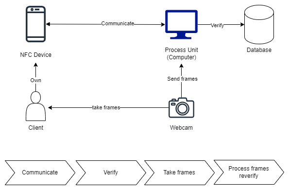

# Wireless based AMS 


## Near field communication (NFC)
This chapter is an intro to NFC and provide advantages of using it in **AMS**. I will explain how NFC technologies work, and how they differ too.

NFC operates in three distinct modes: reader/writer mode, card emulation mode, and peer-to-peer mode. In reader/writer mode, the NFC device interacts with an NFC tag, either reading data from or writing data to the tag. In peer-to-peer mode, two NFC devices exchange data directly. In card emulation mode, the NFC device mimics a contactless smart card, making it detectable by NFC readers. A notable application of NFC technology is the Smart Poster. These posters embed information such as URLs, phone numbers, or SMS within an NFC tag, which is then attached to a physical object. By tapping the tag with an NFC-enabled device, users can initiate actions like making phone calls, launching websites, or sending text messages.


In our proposed system we will use a peer-to-peer mode. But, let's first understand how NFC works.

I will try to explain the [article](https://salmg.net/2017/09/12/intro-to-analyze-nfc-contactless-cards/) written by *Salvador Mendoza* aka **salmg**.

To understand how a PoS (Point of Sale) or a terminal interact with an NFC devide. to put this simply, a PoS is a device that can read and write to an NFC device (a card or a phone).

So, how does it work?

Let's create a scenario to understand how PoS interact with NFC device. imagine you have a computer. you turn on the computer and the computer respond with an image asking you to put on the password. if the password is wrong, it will return an error. This is the same logic that goes with the terminal (PoS) and NFC card. the terminal start the communication with the card asking for information. it uses [APDU](https://en.wikipedia.org/wiki/Smart_card_application_protocol_data_unit) communication protocol (Application Protocol Data Unit).

APDUs are set of command that both ends interact with. It looks like folders with different subdivisions and for the terminal to access any of these it needs to ask each time for an "id-keys"  or for the route (path) to get into the information.


### Starting the communication 

in the following example, we provide an advanced example of the structure of proposed NFC that includes a username, picture and plan type. and We see how the terminal communicate with the NFC-enabled device (phone for this example)

**Master File (MF)**
- Contains general management and control information.
- Hosts the entire file system structure.

**Dedicated File (DF)**
- **DF1**: User Data
  - **EF1**: Username (String)
  - **EF2**: Picture (Binary or URL)
  - **EF3**: Plan (String)
- **DF2**: Payment System Environment (PSE)
  - **EF4**: Payment credentials (Encrypted data)

**Elementary Files (EFs)**
- **EF1**: Contains Username.
- **EF2**: Contains Picture.
- **EF3**: Contains Plan.
- **EF4**: Contains payment credentials like tokenized card information or digital wallet identifiers.

**Example APDU Command to Select the User Data DF**
- **CLA**: `0x00`
- **INS**: `0xA4`
- **P1**: `0x01` (Select Child DF)
- **P2**: `0x00`
- **Data**: Identifier of the DF1 (e.g., 'User Data')
- **Le**: `0x00`

**Response**
- **Data**: Confirmation of DF selection.
- **SW1-SW2**: Status words, `0x9000` if successful.

**Use Case:**
- Upon tapping the NFC-enabled phone at the entry, the terminal sends a SELECT command to navigate through the NFC structure, accessing user details securely and facilitating quick, streamlined entry management.


You can also write to the NFC-enabled device in order to secure your **AMS** system and introduce

the following code provided by generative-ai for scanning face and find it in dataset.

```python
import cv2
import face_recognition
import pickle

# Load known face encodings and names
with open('face_encodings.pkl', 'rb') as f:
    known_faces = pickle.load(f)

# Get a reference to webcam
video_capture = cv2.VideoCapture(0)

while True:
    # Grab a single frame of video
    ret, frame = video_capture.read()

    # Convert the image from BGR color (which OpenCV uses) to RGB color (which face_recognition uses)
    rgb_frame = frame[:, :, ::-1]

    # Find all the faces and face encodings in the current frame of video
    face_locations = face_recognition.face_locations(rgb_frame)
    face_encodings = face_recognition.face_encodings(rgb_frame, face_locations)

    # Loop through each face found in the frame to see if it's someone we know
    for (top, right, bottom, left), face_encoding in zip(face_locations, face_encodings):
        matches = face_recognition.compare_faces(known_faces['encodings'], face_encoding)
        name = "Unknown"

        if True in matches:
            first_match_index = matches.index(True)
            name = known_faces['names'][first_match_index]

        # Draw a box around the face
        cv2.rectangle(frame, (left, top), (right, bottom), (0, 0, 255), 2)

        # Draw a label with a name below the face
        cv2.rectangle(frame, (left, bottom - 25), (right, bottom), (0, 0, 255), cv2.FILLED)
        font = cv2.FONT_HERSHEY_DUPLEX
        cv2.putText(frame, name, (left + 6, bottom - 6), font, 0.75, (255, 255, 255), 1)

    # Display the resulting image
    cv2.imshow('Video', frame)

    # Hit 'q' on the keyboard to quit!
    if cv2.waitKey(1) & 0xFF == ord('q'):
        break

# Release handle to the webcam
video_capture.release()
cv2.destroyAllWindows()

```


### Proposed implementation


We propose a system that recognize a person by their facial biometrics and NFC.

The NFC terminal will be connected to a computer and a camera that will check the data provided by the NFC and the face of the new user. It will then check the dataset and tell if the person saved on the NFC card is the same person. In case of an error, the user won't be accepted. the user can report the issue and an automated message will be sent to the staff to recheck (can be sent through telegram).

The following picture showcase the strategy proposed for the **AMS** system with NFC technology:




## Radio Frequency identification

This chapter is an intro to radio frequency identification and the different implementation of this technology on the field of **AMS**.

RFID typically requires more expensive techs to implement it. the following components are critical :

- **RFID reader**
- **RFID antenna**
- **Transponder**

RFID tags can't be written to wirelessly it shall be connected with a **MFRC522** and arduino microprocesser to be able to write data to it. it has a very limited storage of only 4k block. each block can store up to 16 bytes which means a max of 64 KB maximum.

RFID tags stores data on plaintext which means a manual encryption shall be considered.


basically an rfid reader reads the RFID tag stored data and transmit it to the computer which will either store or verify data. The computer will do most of the process too.


## RFID or NFC which one is better?


In this section we will expose the main differences between **NFC** and **RFID** technologies and discuss which one holds a better value to our automated **AMS** system.

| Feature             | RFID                               | NFC                                 |
|---------------------|------------------------------------|-------------------------------------|
| Frequency Range     | Low Frequency (LF), High Frequency (HF), and Ultra-High Frequency (UHF) | 13.56 MHz only                      |
| Transmission Speed  | - LF/HF RFID: Up to 424 Kbps<br>- UHF RFID: Can read hundreds of tags per second | 106 Kbps, 212 Kbps, or 424 Kbps     |
| Typical Use Cases   | - Inventory tracking<br>- Access control<br>- Supply chain management | - Mobile payments<br>- Ticketing<br>- Data sharing |
| Communication Range | - LF/HF RFID: Up to a few feet<br>- UHF RFID: Up to several meters | Typically up to 4 cm                |
| Interaction Type    | Typically passive (tags powered by reader) | Can be passive or active             |


**Table** : technical comparison of RFID and NFC technologies

There is not a big transmission speed and communication range doesn't really matter in our case (*AMS* system). Even in security level it doesn't really matter because both systems stored data needs to get encrypted because it can be easily sniffed and spoofed.


| Feature           | RFID                                             | NFC                                                  |
|-------------------|--------------------------------------------------|------------------------------------------------------|
| Compatibility     | Compatible with many industrial systems          | Broad compatibility with smartphones and tablets     |
| Price             | - Passive tags are generally cheap<br>- Active RFID systems (tags and readers) can be expensive | Generally inexpensive due to widespread integration in mobile devices |
| Flexibility       | Limited to specific applications (fixed functions) | Highly flexible; can be reprogrammed and altered for various uses |
| Widespread Use    | Used extensively in supply chain, inventory management, and access control | Found in almost every new generation mobile; used for payments, ticketing, and data sharing |

**Table** : compatibility comparison of RFID and NFC technologies


| Range          | iPhone                                       | Samsung                                               | Redmi (Xiaomi)                  |
|----------------|----------------------------------------------|-------------------------------------------------------|----------------------------------|
| **High End**   | iPhone 13 (All Variants)                     | Galaxy S22 Ultra                                      | Xiaomi 13 Ultra                 |
|                | iPhone 12 Pro, 12 Pro Max                    | Galaxy S21 Ultra                                      | Xiaomi Mi 11                    |
|                | iPhone 11 Pro, 11 Pro Max                    | Galaxy S20 Ultra                                      | Xiaomi Mi 10T Pro               |
|                | iPhone XS, XS Max                            | Galaxy Note 20 Ultra                                  |                                 |
|                |                                              | Galaxy Z Fold 3                                       |                                 |
|                |                                              | Galaxy Z Flip 3                                       |                                 |
| **Mid End**    | iPhone 12, 12 Mini                           | Galaxy S22, S22+                                      | Redmi Note 12 Pro 4G            |
|                | iPhone 11                                    | Galaxy S21, S21+                                      | Redmi Note 10 Pro               |
|                | iPhone XR                                    | Galaxy S20, S20+                                      | Redmi K50 Gaming                |
|                | iPhone X                                     | Galaxy Note 20                                        | Redmi K40                       |
|                | iPhone 8, 8 Plus                             | Galaxy S10, S10+, S10e                                | Xiaomi Mi 9                     |
|                | iPhone 7, 7 Plus                             | Galaxy Note 10, Note 10+                              | Redmi Note 9 Pro                |


**Table** : Some phones that are **NFC-enabled**

### Summary

**RFID** is well used on industrial systems where information are typically constant, unchanging tasks like inventory tracking or identifying products. NFC , on the other hand, offer greater flexibility and is embedded in modern smartphones, making it easily accessible and reprogrammable. 

RFID can be expensive, especially for `active system`, NFC costs are minimized cause of integration into existing smartphones. This which makes **NFCs** a more economical solution and an easier implementation, less time consuming too and dynamic too.
