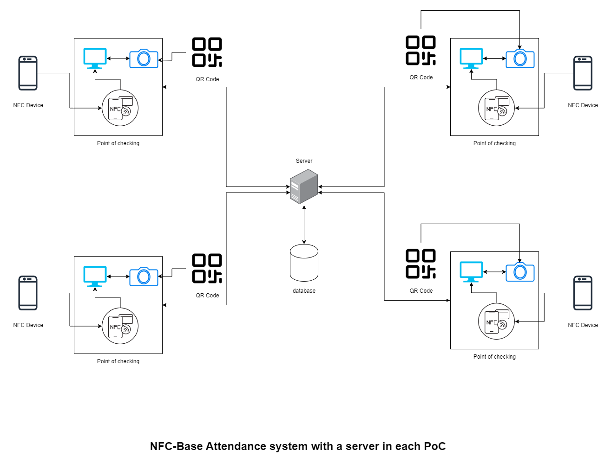

# SecureGate: Attendance Management System

SecureGate is a **multitech attendance management system (mAMS)**

## SecureGate sturcture

SecureGate uses three different technologies to ensure integrity, effciencty and of course security. Our solution include Quick response (**QR**), face recongnition program and finally a near field communication (**NFC**) checking system.

These three systems are connected to a process unit (it can be a computer, an arduino, anything really that can connect to internet and execute python script). The process unit extract data and send to the server which will verify information in database. 

The following image represent the suggested structure of **SecureGate AMS** :

**Figure** : SecureGate, MultiTech AMS

An attendant can check-in through either using the NFC chipset in his mobile or using a QR code he either downloads in his phone or print on a paper (can be found on a badge provided by the staff too).

In the following sections we explain the developement process and the measures took to ensure security, flexibility and of course effeciency.

## Matrix code implementation

As we discussed in the last chapters, matrix codes are a cheap and important choice to implement on an **AMS** system.  